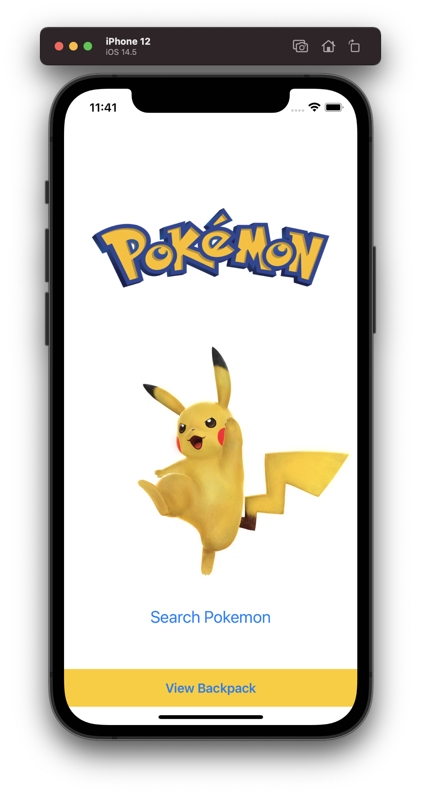
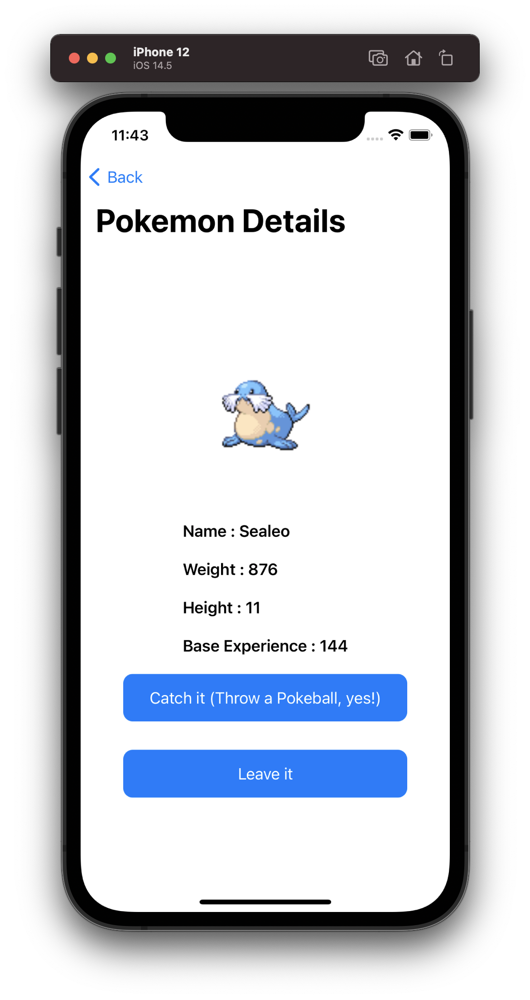

# PokédexTest: iOS Challenge


## Author:- Akanksha Garg
email: <akanksha.garg9@gmail.com>

## Overview

App is meant to be for personal use, but no account nor registration is needed. The app shows the backpack of a Pokemon trainer when he or she starts.
User can catch the pokemon and save it in backpack, where pokemons will stay forever! 
**Note: Pokemon can be catched only once.


## Architecture

This project follows MVVM Architecture.
 - Model:  Simple data model objects.
 - View : Includes data related to UI of application like Views
 - ViewModel:  Contains the business logic for a particular use case and handles preparing content for the display.

The project is segregated into three main layers.
  - Domain: This is the core of our application. It contains Entities and ViewModels.
  - Presentation: It contains Views.
  - Application: It contains Models, Network Manager.
  - Database: For all CRUD operations on data.

## Details

### UI
#### Home Search Screen
- The Main Home Screen have a simple search button , where pokemon is searched based of ID randomly generated.
- Ability to view backpack by clicking on simple "View Backpack" button.
- Ability to save pokemon in database by clicking on simple "Catch it" button.
- Ability to not save in database by clicking on simple "Leave it" button.

#### Pokemon Details Screen
- This screen shows pokemon details in a big view.
- Display the "timestamp" when that particular Pokemon is catched.

#### Pokemon Backpack Screen
- This screen shows Grid View displaying Pokemons caught by user. (In database)
- By tapping on a thumbnail a new page "Pokemon Details Screen" should be opened to display the corresponding pokemon details in a bigger view.


### Platform
The app work on both, iOS devices (iPhone, iPad) and in simulators.

### Programming language
The app is written in both SwiftUI and Swift.


## Server API
API Base URL: 'https://pokeapi.co/api/v2'

API endpoint to fetch the pokemon list:
```
GET : /pokemon/?appId=<Pokemon_Id>
```
Returns details of current pokemon as JSON. 


## Shipping
Project is pushed in GitHub repo on develop branch.  ()

## Screenshots




